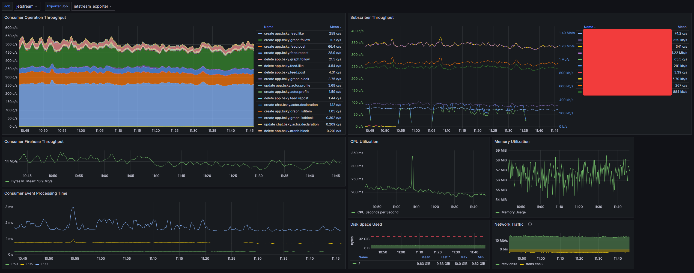

# Jetstream

## FYI: Jetstream is now being maintained in the [bsky-social](https://github.com/bluesky-social/jetstream) org

This repo will stick around as an artifact but the fork in `bsky-social` is where I'll be making active updates.

Jetstream is a streaming service that consumes an ATProto `com.atproto.sync.subscribeRepos` stream and converts it into lightweight, friendly JSON.

Jetstream converts the CBOR-encoded MST blocks produced by the ATProto firehose and translates them into JSON objects that are easier to interface with using standard tooling available in programming languages.

## Running Jetstream

To run Jetstream, make sure you have docker and docker compose installed and run `make up` in the repo root.

This will pull the latest built image from GHCR and start a Jetstream instance at `http://localhost:6008`

- To build Jetstream from source via Docker and start it up, run `make rebuild`

Once started, you can connect to the event stream at: `ws://localhost:6008/subscribe`

Prometheus metrics are exposed at `http://localhost:6008/metrics`

A [Grafana Dashboard](#dashboard-preview) for Jetstream is available at `./grafana-dashboard.json` and should be easy to copy/paste into Grafana's dashboard import prompt.

- This dashboard has a few device-specific graphs for disk and network usage that require NodeExporter and may need to be tuned to your setup.

## Consuming Jetstream

To consume Jetstream you can use any websocket client

Connect to `ws://localhost:6008/subscribe` to start the stream

- A publicly available instance of Jetstream is available at `wss://jetstream.atproto.tools/subscribe`

The following Query Parameters are supported:

- `wantedCollections` - An array of [Collection NSIDs](https://atproto.com/specs/nsid) to filter which records you receive on your stream (default empty = all collections)
  - Regardless of desired collections, all subscribers recieve Account and Identity events
- `wantedDids` - An array of Repo DIDs to filter which records you receive on your stream (Default empty = all repos)
- `cursor` - A unix microseconds timestamp cursor to begin playback from
  - An absent cursor or a cursor from the future will result in live-tail operation
  - When reconnecting, use the `time_us` from your most recently processed event and maybe provide a negative buffer (i.e. subtract a few seconds) to ensure gapless playback

A simple example that hits the public instance looks like:

```bash
$ websocat wss://jetstream.atproto.tools/subscribe\?wantedCollections=app.bsky.feed.post
```

A maximal example using all parameters looks like:

```bash
$ websocat "ws://localhost:6008/subscribe?wantedCollections=app.bsky.feed.post&wantedCollections=app.bsky.feed.like&wantedCollections=app.bsky.graph.follow&wantedDids=did:plc:q6gjnaw2blty4crticxkmujt&cursor=1725519626134432"
```

### Example events:

#### A like committed to a repo

```json
{
  "did": "did:plc:eygmaihciaxprqvxpfvl6flk",
  "time_us": 1725911162329308,
  "type": "com",
  "commit": {
    "rev": "3l3qo2vutsw2b",
    "type": "c",
    "collection": "app.bsky.feed.like",
    "rkey": "3l3qo2vuowo2b",
    "record": {
      "$type": "app.bsky.feed.like",
      "createdAt": "2024-09-09T19:46:02.102Z",
      "subject": {
        "cid": "bafyreidc6sydkkbchcyg62v77wbhzvb2mvytlmsychqgwf2xojjtirmzj4",
        "uri": "at://did:plc:wa7b35aakoll7hugkrjtf3xf/app.bsky.feed.post/3l3pte3p2e325"
      }
    },
    "cid": "bafyreidwaivazkwu67xztlmuobx35hs2lnfh3kolmgfmucldvhd3sgzcqi"
  }
}
```

#### A deleted follow record

```json
{
  "did": "did:plc:rfov6bpyztcnedeyyzgfq42k",
  "time_us": 1725516666833633,
  "type": "com",
  "commit": {
    "rev": "3l3f6nzl3cv2s",
    "type": "d",
    "collection": "app.bsky.graph.follow",
    "rkey": "3l3dn7tku762u"
  }
}
```

#### An identity update

```json
{
  "did": "did:plc:ufbl4k27gp6kzas5glhz7fim",
  "time_us": 1725516665234703,
  "type": "id",
  "identity": {
    "did": "did:plc:ufbl4k27gp6kzas5glhz7fim",
    "handle": "yohenrique.bsky.social",
    "seq": 1409752997,
    "time": "2024-09-05T06:11:04.870Z"
  }
}
```

#### An account becoming active

```json
{
  "did": "did:plc:ufbl4k27gp6kzas5glhz7fim",
  "time_us": 1725516665333808,
  "type": "acc",
  "account": {
    "active": true,
    "did": "did:plc:ufbl4k27gp6kzas5glhz7fim",
    "seq": 1409753013,
    "time": "2024-09-05T06:11:04.870Z"
  }
}
```

### Dashboard Preview


